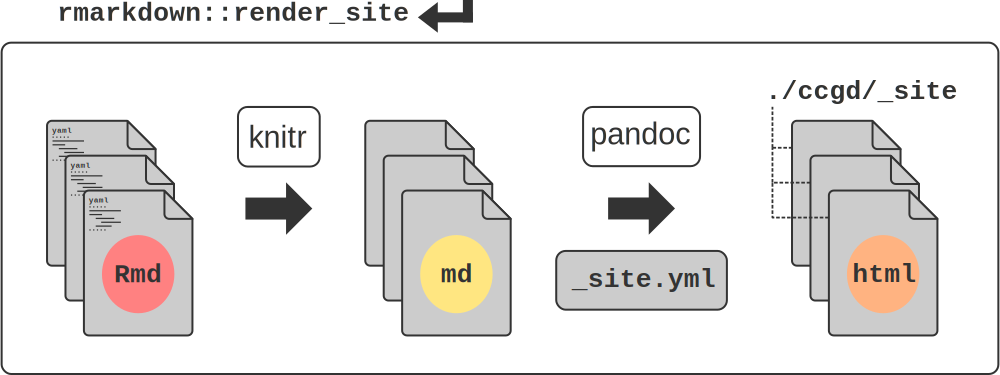
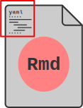
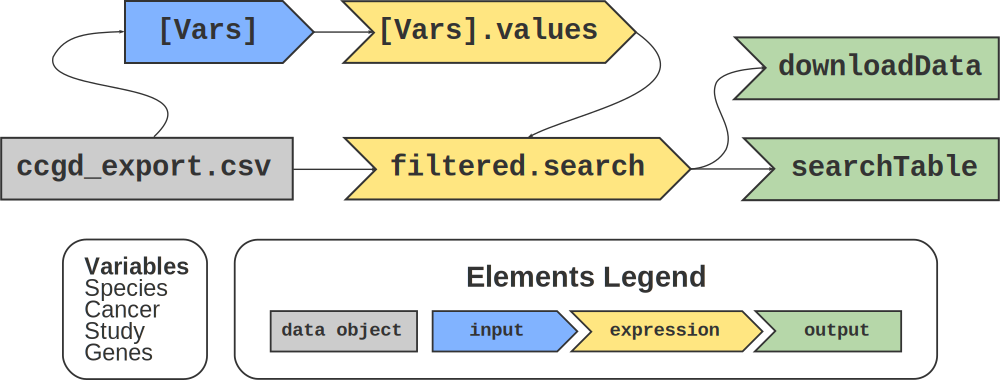
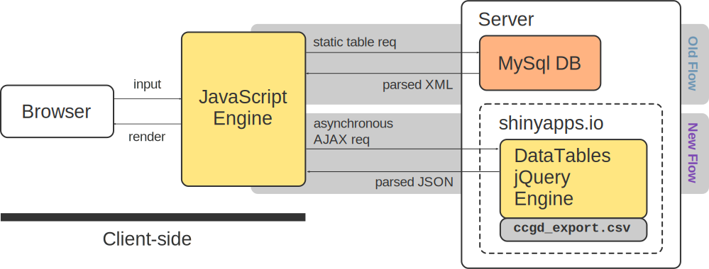
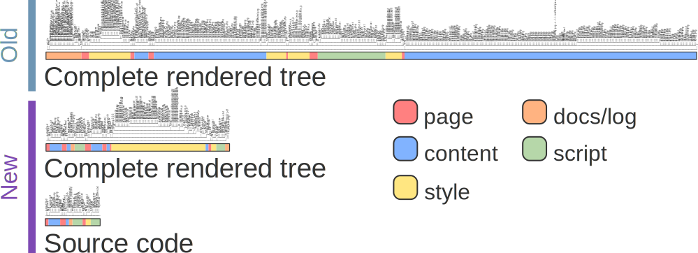
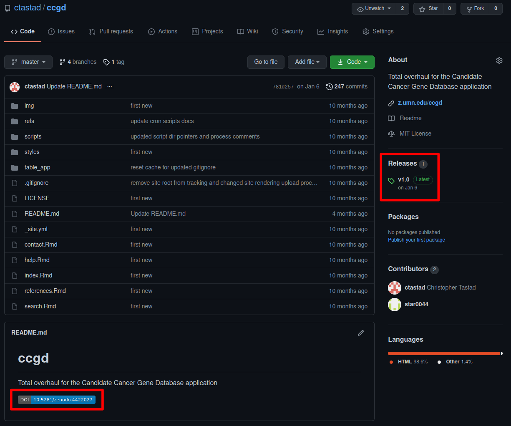

## Presentation ToC
> - Original Concept
> - Challenges
> - Refactoring the Concept
> - Outcomes of Refactoring
> - Conclusions

```{r global_options, include = F}
knitr::opts_chunk$set(eval = F, echo = F, warning = F, message = F)
```

# Original Concept {.center}

--------------------------------------------------------------------------------

## Forward Transposon Screens

--------------------------------------------------------------------------------

## CCGD Overview

--------------------------------------------------------------------------------

## Breakdown of build table process

--------------------------------------------------------------------------------

## OIT setup

################################################################################

# Challenges {.center}

--------------------------------------------------------------------------------

## Forced Upgrades

--------------------------------------------------------------------------------

## Technical Debt
> - test
> - test

################################################################################

# Refactoring the Concept {.center}

--------------------------------------------------------------------------------

## Project Requirements

::: {#table:projectReqs}
      Feature           Goal                       Framework   Description
  --- ----------------- -------------------------- ----------- -------------------------------------------------------------------------------------------------------------------------------------------------------------------------
  1   server OS         upgrade server OS          RHEL7       Transition of architecture for public server host. This is required by University OIT due to end-of-life schedule for RHEL6.
  2   web front-end     rewrite web interface      Rmarkdown   Improvements to the web interface written in a modern, simplified language. This improved access to content creation and allowed for automation in front-end rendering.
  3   table build       rewrite table build        Rshiny      Rshiny offered a dramatic improvement to replace the existing process by merging the table build back-end with a modern web display of the app interface.
  4   content update    improved admin controls    BASH/R      Old app version confined some content controls to app author, limiting ability to make contributions by product owner (Tim Starr).
  5   version control   implement best practices   git/docs    No version control was used in the original development of the app. This and other documentation practices were expanded in the rewrite.
  6   multiple          resource improvements      codebase    Due to the lack of some best practices, there were many opportunities to make impactful resource improvements.

:::

--------------------------------------------------------------------------------

## Front-end Framework


#### Rmarkdown rendering flow {.center}

--------------------------------------------------------------------------------

## Front-end Framework

<div class="column">

```{r echo = T}
title: "Candidate Cancer Gene Database"
bibliography: refs/ccgd_paper.bib
nocite: '@*'
output:
    html_document:
        includes:
            in_header: "styles/favicon.html"
            after_body: "styles/footer.html"
        css: styles/styles.css
        theme: readable
---

```

```{r echo = T}
name: "Candidate Cancer Gene Database"
navbar:
    title: "CCGD"
    left:
        - text: "Home"
          href: index.html
        - text: "Search"
          href: search.html
        - text: "Help"
          href: help.html
        - text: "References"
          href: references.html
        - text: "Contact"
          href: contact.html

```

</div>

#### YAML configuration segments {.center}

<center>

</center>

#### YAML illustration

--------------------------------------------------------------------------------

## Front-end Framework


#### table reactive graph {.center}

--------------------------------------------------------------------------------

## Back-end Framework


#### server-side processing flow {.center}

--------------------------------------------------------------------------------

## Back-end Framework


#### subroutine flow {.center}

################################################################################

# Outcomes of Refactoring {.center}

--------------------------------------------------------------------------------

## Simplified Codebase
```{r echo = T}
df <- read.csv("ccgd_export.csv") # read in base source file
speciesList <- c("Mouse", "Human", "Rat", "Fly", "Fish", "Yeast")

# inputs are arranged in column, width orientation
# each column variable set represents a single input and its params
# next row of inputs layout
ui <- fluidPage( # build shiny app UI
  fluidRow(
    column(
      2,
      selectizeInput("Species",
        label = "Species",
        choices = speciesList
      )
    ),

    column(
      3,
      selectizeInput("Study",
        label = "Study",
        choices = sort(unique(df$Study)),
        selected = NULL,
        multiple = TRUE,
        options = list(placeholder = "All studies")
      )
    ),

    column(
      3,
      selectizeInput("Cancer",
        label = "Cancer",
        choices = sort(unique(df$Cancer)),
        selected = NULL,
        multiple = TRUE,
        options = list(placeholder = "All cancers")
      )
    ),

    column(
      4,
      textAreaInput("Genes",
        label = "Genes",
        placeholder = "GeneA,GeneB,GeneC..."
      )
    )
  ),

  fluidRow(
    column(
      2,
      # button for table export
      downloadButton("downloadData",
        label = "Download"
      )
    )
  ),

  hr(),

  dataTableOutput("searchTable")
)
```

#### app.R Rshiny process snippet {.center}

--------------------------------------------------------------------------------

## Simplified Codebase

```{r echo = T}
---
title: "Candidate Cancer Gene Database"
bibliography: refs/ccgd_paper.bib
nocite: '@*'
output:
    html_document:
        includes:
            in_header: "styles/favicon.html"
            after_body: "styles/footer.html"
        css: styles/styles.css
        theme: readable
---

The Candidate Cancer Gene Database (CCGD) was developed to make accessible a collated set of results from transposon-based forward cancer genetic screens in mice. The value in doing this is to give investigators the ability to quickly filter through the results of many such screens in an effort to determine the candidacy of a gene for its role in cancer.

***

### Background

This work is a product of the [Starr Lab](http://www.med.umn.edu/starrlab/) at the [University of Minnesota](http://www.umn.edu/). The Starr Lab is affiliated with the [Center for Genome Engineering](http://www.cge.umn.edu/), the [Masonic Cancer Center](http://www.cancer.umn.edu/), the Department of [OB/GYN](http://www.obgyn.umn.edu/), and the Department of [Genetics, Cell Biology, and Development](http://www.cbs.umn.edu/gcd/).

##### Contributions

The idea for creating this database originated from Tim Starr, Vincent Keng, and David Largaespada at UMN. Erik Nyre and Ken Abbott developed the original database, with help from Juan Abrahante. A complete website and backend overhaul was conducted by Christopher Tastad in 2019.

* Ken Abbott
* [Erik Nyre](https://www.dorsey.com/people/n/nyre-erik)
* [Juan Abrahante](https://research.umn.edu/units/umii/about-us/staff-directory/juan-e-abrahante-phd)
* [Christopher Tastad](https://github.com/ctastad)

***

##### Updates

The most recent table build was completed on:

<object type="text/html"
        height=40px
        data="build_date.txt"></object>

```

#### index.html page content snippet {.center}

--------------------------------------------------------------------------------

## Simplified Codebase


#### Project Directory File Tree Comparison {.center}

--------------------------------------------------------------------------------

## Visual Improvements


#### search interface changes {.center}

--------------------------------------------------------------------------------

## Resource Use Reduction


#### disk use comparison {.center}

--------------------------------------------------------------------------------

## Improved Admin Controls

```{r echo = T}
#   Executed:   locally from the CCGD project dir
#   Options:    -b build (TRUE,FALSE) -s full proj dir sync (TRUE,FALSE)
#               -t table upload file -r reference upload file
#               -k (TURE,FALSE) render site files

# pass arguments from cli
while getopts b:t:r:s: option
do
    case "${option}"
        in
        b) build=${OPTARG};;
        t) table=${OPTARG};;
        r) refs=${OPTARG};;
        s) sync=${OPTARG};;
    esac
done
```

#### ccgd_upload.sh script snippet {.center}

--------------------------------------------------------------------------------

## Sustainable Development


#### project documentation example {.center}

--------------------------------------------------------------------------------

## Sustainable Development


#### public application github repository

--------------------------------------------------------------------------------

## Sustainable Development



#### Zenodo-supplied DOI and release for reproducibility {.center}

################################################################################

# Conclusions {.center}

## Conclusions

## Acknowledgements

## The End {.center}

<!-- style -->

<style>

body {
  background: #2e3440;
}

.column {
  column-count: 2;
}

div.sourceCode {
  background-color: #2e3440;
}

.sourceCode {
  background-color: #393f4b;
}

.reveal section img {
  border: 30px solid #e0e1e2;
  border-radius: 10px;
  }

  .reveal p {
    text-align: left;
  }
  .reveal ul {
    display: block;
  }
  .reveal ol {
    display: block;
  }

</style>

<!-- slide templates

## Section Title {.center}


## Multi-Column Slide

<div class="column">

### column1
- some cool words
- https://www.merriam-webster.com/dictionary/wherever

### column2
- some more cool words

</div>


## Figure Slide
```{r eval=T}
attach(mtcars)
par(mfrow=c(2,2))
plot(wt,mpg, main="Scatterplot of wt vs. mpg")
plot(wt,disp, main="Scatterplot of wt vs disp")
hist(wt, main="Histogram of wt")
boxplot(wt, main="Boxplot of wt")
```


## Code Slide

```{r echo = T}
x = 1
if x == 1:
    # indented four spaces
    print("x is 1.")
```

-->

