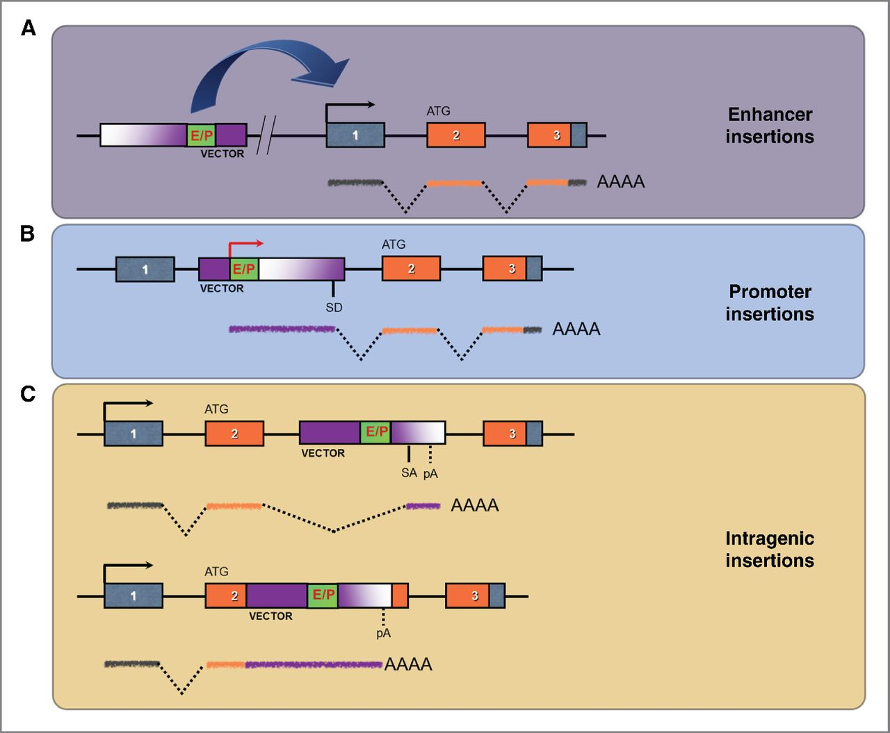
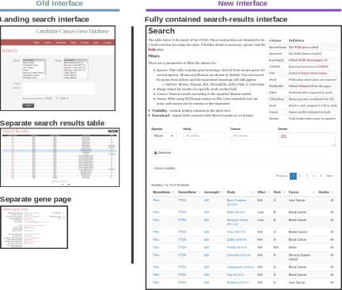
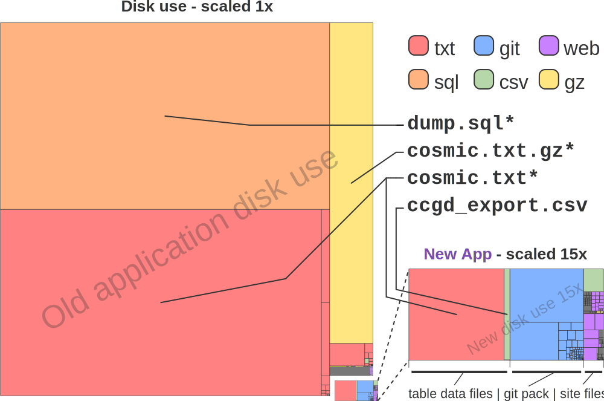
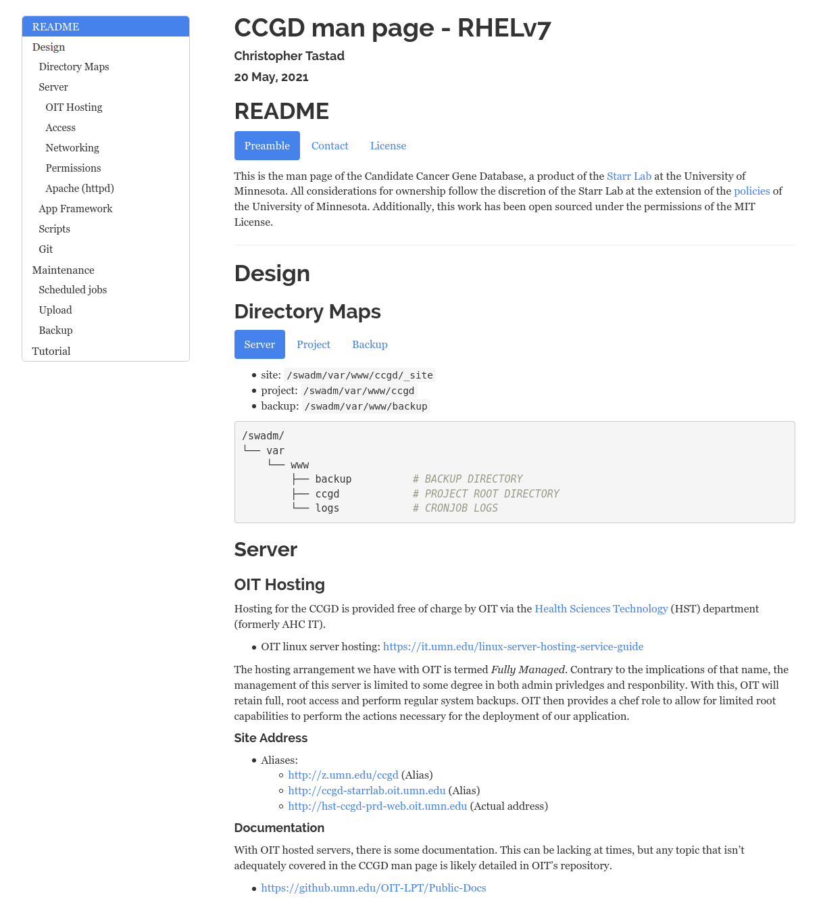
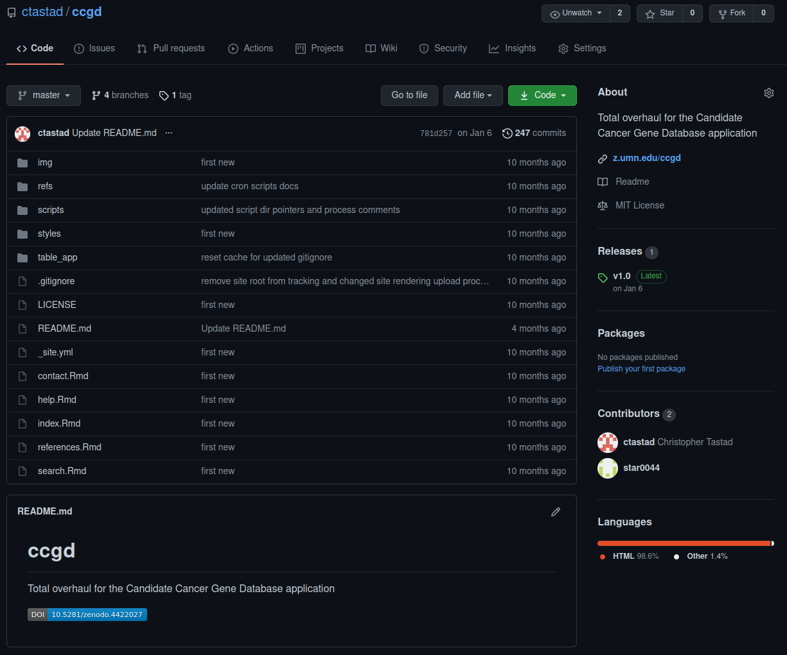

## Presentation ToC
> - Original Concept
> - Issue
> - Refactoring the Concept
> - Outcomes of Refactoring
> - Conclusions

```{r global_options, include = F}
knitr::opts_chunk$set(eval = F, echo = F, warning = F, message = F)
```

# Original Concept {.center}

## Original Concept


> - Cancer bio is complicated
> - Driver genes present primary targets
> - Screening methods...

<div class="notes">
- look at the origins and maintenance of the ccgd
- why does such a tool exist
- what purpose does it offer the field

---

- Cancer biology presents a highly complex genetic landscape.
- Cohorts of genes act as drivers for the progression of cancer.
- These genes present targets for study and development of therapeutics.
- Ultimately, we need to understand and simplify cancer gene targets.
- Screening methods offer quicker access to wide swaths of these targets.
</div>

--------------------------------------------------------------------------------

## Forward Transposon Screens



<small>Ranzani, Marco, et al. “Cancer Gene Discovery: Exploiting Insertional Mutagenesis.” Mol Cancer Res, vol. 11, no. 10, 2013, pp. 1141–1158., doi:10.1158/1541-7786.MCR-13-0244.</small>

<div class="notes">
- gene cassette is used to place a genetic payload at some region relative to a transcriptional site to induce mutagenesis
- figure shows 3 mechanisms to derive outcome
- A: enhancer insertion likely upstream of promoter.
- B: vector integrates within some transcriptional range and co-ops promotor function from gene itself.
- C: intragenic insertions may disrupt coding regions generating novel proteins with GoF or LoF outcomes impacting tumorigenesis or tumor suppression.
</div>

--------------------------------------------------------------------------------

## Forward Transposon Screens


<small>Ranzani, Marco, et al. “Cancer Gene Discovery: Exploiting Insertional Mutagenesis.” Mol Cancer Res, vol. 11, no. 10, 2013, pp. 1141–1158., doi:10.1158/1541-7786.MCR-13-0244.</small>

<div class="notes">
- transposon method is applied en masse within mice.
- process of extraction, isolation, seq, and analysis identifies CIS groups.
- validation takes place in vitro or in vivo for oncogenic potential with orthologous association to human candidates.
- idea for CCGD comes in at the star.
</div>

--------------------------------------------------------------------------------

## CCGD Goals

> To facilitate analysis of driver genes to catalog all common insertion sites (CISs) and their corresponding genes identified in published studies using transposon insertional mutagenesis.

> - Create a web tool
> - Form homology relationships
> - Curate disease classification
> - Offer connections to external tools

<div class="notes">
- Create an interactive web tool to quickly refine the stated data set by a variety of parameters.
- Draw from universal resources to define homology relationships for candidate genes between animal models.
- Curate disease classification and meta-analysis through complete CIS listing and relative rank and strength scores.
- Offer easy access to external tools from filtered results for deeper biological context.

---

- relative rank was based either on the number of insertions in a given CIS or the P-value associated with the given CIS
- The relative rank was calculated by ranking all CISs in a given study and then assigning grades
- We assigned a letter grade of A for the top 10%, B for the top 11–25%, C for the top 26–50% and D for the bottom 50%.
</div>

--------------------------------------------------------------------------------

## CCGD Implementation

**ETL Process**

scrape data &rarr; homology association &rarr; integrate into table


<div class="container">

<div class="col">
#### Data Sources/Links
- NCBI Gene
- NCBI HomoloGene
- NCBI PubMed
- Sanger COSMIC
- Sanger CGC
- GeneCards
</div>

<div class="col">
> - Filtered results are downloadable
> - Wrapped in a simple, instructional website built with classic LAMP stack
> - Hosted by UMN-OIT
</div>

</div>

<div class="notes">
- Search Within - mouse human rat fly fish yeast
</div>


################################################################################

# Issue {.center}

--------------------------------------------------------------------------------

## Issue

### Forced OS upgrade from UMN-OIT host

--------------------------------------------------------------------------------

## Challenges

#### Can this application be upgraded as-is?

<div class="notes">
- several of these items blend limitations that are dependency-based, while others amount to an inconvenience.
</div>

**Primary Challenges**

> - Machine displacement in provisioning by UMN-OIT
> - Use of abandoned, proprietary widgets
> - Outsized SQL database

**Secondary Challenges**

> - Documentation missing visibility for admins
> - Total app disk use
> - Lack of version control
> - Odd hosting paradigm from UMN-OIT
> - Disorderly codebase, residual WYSIWYG effects
> - Lack of modularity in back-end
> - Pending web standards compliance issues

<div class="notes">
- these are a combination of both limitations and potential goals
</div>

--------------------------------------------------------------------------------

## Challenges

#### Can this application be upgraded as-is?

**Primary Challenges**

- <span style="color: #a3be8c;">**Machine displacement in provisioning by UMN-OIT**</span>
- Use of abandoned, proprietary widgets
- <span style="color: #a3be8c;">**Outsized SQL database**</span>

**Secondary Challenges**

- Documentation missing visibility for admins
- Total app disk use
- Lack of version control
- Odd hosting paradigm from UMN-OIT
- Disorderly codebase, residual WYSIWYG effects
- Lack of modularity in back-end
- Pending web standards compliance issues

--------------------------------------------------------------------------------

## Challenges

### Ultimately, a drop-in transition was not possible.


################################################################################

# Refactoring the Concept {.center}

--------------------------------------------------------------------------------

## Project Requirements

::: {#table:projectReqs}
      Feature           Goal                       Framework   Description
  --- ----------------- -------------------------- ----------- -------------------------------------------------------------------------------------------------------------------------------------------------------------------------
  1   server OS         upgrade server OS          RHEL7       Transition of architecture for public server host. This is required by University OIT due to end-of-life schedule for RHEL6.
  2   web front-end     rewrite web interface      Rmarkdown   Improvements to the web interface written in a modern, simplified language. This improved access to content creation and allowed for automation in front-end rendering.
  3   table build       rewrite table build        Rshiny      Rshiny offered a dramatic improvement to replace the existing process by merging the table build back-end with a modern web display of the app interface.
  4   content update    improved admin controls    BASH/R      Old app version confined some content controls to app author, limiting ability to make contributions by product owner.
  5   version control   implement best practices   git/docs    No version control was used in the original development of the app. This and other documentation practices were expanded in the rewrite.
  6   multiple          resource improvements      codebase    Due to the lack of some best practices, there were many opportunities to make impactful resource improvements.

:::

--------------------------------------------------------------------------------

## Front-end Framework


#### Rmarkdown rendering flow {.center}

--------------------------------------------------------------------------------

## Front-end Framework

<div class="container">

<div class="col">
```{r echo = T}
---
title: "Candidate Cancer Gene Database"
bibliography: refs/ccgd_paper.bib
nocite: '@*'
output:
    html_document:
        includes:
            in_header: "styles/favicon.html"
            after_body: "styles/footer.html"
        css: styles/styles.css
        theme: readable
---

```
</div>

<div class="col">
```{r echo = T}
---
name: "Candidate Cancer Gene Database"
navbar:
    title: "CCGD"
    left:
        - text: "Home"
          href: index.html
        - text: "Search"
          href: search.html
        - text: "Help"
          href: help.html
        - text: "References"
          href: references.html
        - text: "Contact"
          href: contact.html
---
```
</div>

</div>

#### YAML configuration segments {.center}

<center>

</center>

#### YAML illustration

--------------------------------------------------------------------------------

## Front-end Framework


#### table reactive graph {.center}

<div class="notes">
- rshiny format is ui + server -> deployment
- server is made up of reactive constructs of inputs, expressions, and outputs
- employs declarative programming style allowing for lazy code execution.
- define loose, high level controls to passively fill functional requirements
- improves flexibility for dev and machine - resource use reduce through modularity in code execution
- our app uses 2 state path
</div>

--------------------------------------------------------------------------------

## Back-end Framework


#### server-side processing flow {.center}

<div class="notes">
- typically, server side processing with a table of this side would be prohibitive
</div>

--------------------------------------------------------------------------------

## Back-end Framework


#### subroutine flow {.center}

################################################################################

# Outcomes of Refactoring {.center}

--------------------------------------------------------------------------------

## Simplified Codebase

<div class="notes">
- codebase simplified in a few ways.
- build table process was dramatically streamlined.
- shiny snippet represents full set of code needed to render app ui. app is 200 lines total.
- lines of code replacement is orders of magnitude. possibly 1:100.
- use of this script allowed for elimination of entire sql database.
</div>

```{r echo = T}
df <- read.csv("ccgd_export.csv") # read in base source file
speciesList <- c("Mouse", "Human", "Rat", "Fly", "Fish", "Yeast")

# inputs are arranged in column, width orientation
# each column variable set represents a single input and its params
# next row of inputs layout
ui <- fluidPage( # build shiny app UI
  fluidRow(
    column(
      2,
      selectizeInput("Species",
        label = "Species",
        choices = speciesList
      )
    ),

    column(
      3,
      selectizeInput("Study",
        label = "Study",
        choices = sort(unique(df$Study)),
        selected = NULL,
        multiple = TRUE,
        options = list(placeholder = "All studies")
      )
    ),

    column(
      3,
      selectizeInput("Cancer",
        label = "Cancer",
        choices = sort(unique(df$Cancer)),
        selected = NULL,
        multiple = TRUE,
        options = list(placeholder = "All cancers")
      )
    ),

    column(
      4,
      textAreaInput("Genes",
        label = "Genes",
        placeholder = "GeneA,GeneB,GeneC..."
      )
    )
  ),

  fluidRow(
    column(
      2,
      # button for table export
      downloadButton("downloadData",
        label = "Download"
      )
    )
  ),

  hr(),

  dataTableOutput("searchTable")
)
```

#### app.R Rshiny process snippet {.center}

--------------------------------------------------------------------------------

## Simplified Codebase

<div class="notes">
- Page content is now written in a highly accessible syntax and rendered with a lean script.
</div>

```{r echo = T}
---
title: "Candidate Cancer Gene Database"
bibliography: refs/ccgd_paper.bib
nocite: '@*'
output:
    html_document:
        includes:
            in_header: "styles/favicon.html"
            after_body: "styles/footer.html"
        css: styles/styles.css
        theme: readable
---

The Candidate Cancer Gene Database (CCGD) was developed to make accessible a collated set of results from transposon-based forward cancer genetic screens in mice. The value in doing this is to give investigators the ability to quickly filter through the results of many such screens in an effort to determine the candidacy of a gene for its role in cancer.

***

### Background

This work is a product of the [Starr Lab](http://www.med.umn.edu/starrlab/) at the [University of Minnesota](http://www.umn.edu/). The Starr Lab is affiliated with the [Center for Genome Engineering](http://www.cge.umn.edu/), the [Masonic Cancer Center](http://www.cancer.umn.edu/), the Department of [OB/GYN](http://www.obgyn.umn.edu/), and the Department of [Genetics, Cell Biology, and Development](http://www.cbs.umn.edu/gcd/).

##### Contributions

The idea for creating this database originated from Tim Starr, Vincent Keng, and David Largaespada at UMN. Erik Nyre and Ken Abbott developed the original database, with help from Juan Abrahante. A complete website and backend overhaul was conducted by Christopher Tastad in 2019.

* Ken Abbott
* [Erik Nyre](https://www.dorsey.com/people/n/nyre-erik)
* [Juan Abrahante](https://research.umn.edu/units/umii/about-us/staff-directory/juan-e-abrahante-phd)
* [Christopher Tastad](https://github.com/ctastad)

***

##### Updates

The most recent table build was completed on:

<object type="text/html"
        height=40px
        data="build_date.txt"></object>

```

#### index.html page content snippet {.center}

--------------------------------------------------------------------------------

## Simplified Codebase

```{r echo = T}
---
title: "Candidate Cancer Gene Database"
bibliography: refs/ccgd_paper.bib
nocite: '@*'
output:
    html_document:
        includes:
            in_header: "styles/favicon.html"
            after_body: "styles/footer.html"
        css: styles/styles.css
        theme: readable
---

The Candidate Cancer Gene Database (CCGD) was developed to make accessible a collated set of results from transposon-based forward cancer genetic screens in mice. The value in doing this is to give investigators the ability to quickly filter through the results of many such screens in an effort to determine the candidacy of a gene for its role in cancer.

***

### Background

This work is a product of the [Starr Lab](http://www.med.umn.edu/starrlab/) at the [University of Minnesota](http://www.umn.edu/). The Starr Lab is affiliated with the [Center for Genome Engineering](http://www.cge.umn.edu/), the [Masonic Cancer Center](http://www.cancer.umn.edu/), the Department of [OB/GYN](http://www.obgyn.umn.edu/), and the Department of [Genetics, Cell Biology, and Development](http://www.cbs.umn.edu/gcd/).

##### Contributions

The idea for creating this database originated from Tim Starr, Vincent Keng, and David Largaespada at UMN. Erik Nyre and Ken Abbott developed the original database, with help from Juan Abrahante. A complete website and backend overhaul was conducted by Christopher Tastad in 2019.

* Ken Abbott
* [Erik Nyre](https://www.dorsey.com/people/n/nyre-erik)
* [Juan Abrahante](https://research.umn.edu/units/umii/about-us/staff-directory/juan-e-abrahante-phd)
* [Christopher Tastad](https://github.com/ctastad)

***

##### Updates

The most recent table build was completed on:

<object type="text/html"
        height=40px
        data="build_date.txt"></object>

```

#### index.html page content snippet {.center}

```{r echo = T}
setwd("..")

# render core webpages
rmarkdown::render("index.Rmd")
rmarkdown::render("search.Rmd")
rmarkdown::render("help.Rmd")
rmarkdown::render("references.Rmd")
rmarkdown::render("contact.Rmd")
rmarkdown::render_site("index.Rmd")
```

#### knit_site.R page and site rendering script

--------------------------------------------------------------------------------

## Simplified Codebase


#### Project Directory File Tree Comparison {.center}

--------------------------------------------------------------------------------

## Visual Improvements


#### search interface changes {.center}

--------------------------------------------------------------------------------

## Resource Use Reduction


#### disk use comparison {.center}

--------------------------------------------------------------------------------

## Improved Admin Controls

```{r echo = T}
#   Executed:   locally from the CCGD project dir
#   Options:    -b build (TRUE,FALSE) -s full proj dir sync (TRUE,FALSE)
#               -t table upload file -r reference upload file
#               -k (TURE,FALSE) render site files

# pass arguments from cli
while getopts b:t:r:s: option
do
    case "${option}"
        in
        b) build=${OPTARG};;
        t) table=${OPTARG};;
        r) refs=${OPTARG};;
        s) sync=${OPTARG};;
    esac
done
```

#### ccgd_upload.sh script snippet {.center}

--------------------------------------------------------------------------------

## Sustainable Development


#### project documentation example {.center}

--------------------------------------------------------------------------------

## Sustainable Development



#### public application github repository

--------------------------------------------------------------------------------

## Sustainable Development


#### Zenodo-supplied DOI and release for reproducibility {.center}

################################################################################

# Conclusions {.center}

--------------------------------------------------------------------------------

## Conclusions
> - Stated requirements set out by this project have been met.
> - A new, more modern and simplified framework has been implemented across the full application stack.
> - All original functionality has been sustained.
> - Design and engineering considerations were given to ease future maintenance.

--------------------------------------------------------------------------------

## Future Directions
> - Continuous integration/continuous deployment
> - Anticipating future upgrades and framework evolution

--------------------------------------------------------------------------------

## Acknowledgements

- Tim Starr*
- Yuk Sham*
- Jinhua Wang
- National Marrow Donor Program
- UMN-OIT
- Cassandra Price
- My wife and parents

--------------------------------------------------------------------------------

## The End {.center}

--------------------------------------------------------------------------------

# Supplemental

http://hst-ccgd-prd-web.oit.umn.edu/search.html

<!-- style -->

<style>

body {
  background: #2e3440;
}

.container{
    display: flex;
}

.col{
    flex: 1;
}

div.sourceCode {
  background-color: #2e3440;
}

.sourceCode {
  background-color: #393f4b;
}

.reveal section img {
  border: 30px solid #e0e1e2;
  border-radius: 10px;
  }

  .reveal p {
    text-align: left;
  }
  .reveal ul {
    display: block;
  }
  .reveal ol {
    display: block;
  }

</style>

<!-- slide templates

## Section Title {.center}


## Multi-Column Slide

<div class="column">

### column1
- some cool words
- https://www.merriam-webster.com/dictionary/wherever

### column2
- some more cool words

</div>


## Figure Slide
```{r eval=T}
attach(mtcars)
par(mfrow=c(2,2))
plot(wt,mpg, main="Scatterplot of wt vs. mpg")
plot(wt,disp, main="Scatterplot of wt vs disp")
hist(wt, main="Histogram of wt")
boxplot(wt, main="Boxplot of wt")
```


## Code Slide

```{r echo = T}
x = 1
if x == 1:
    # indented four spaces
    print("x is 1.")
```

-->

